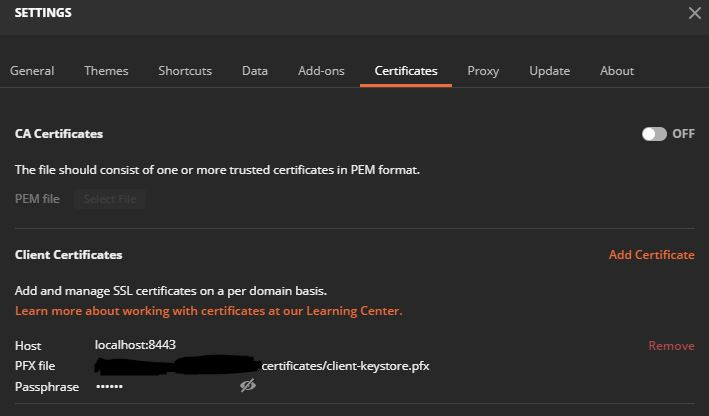
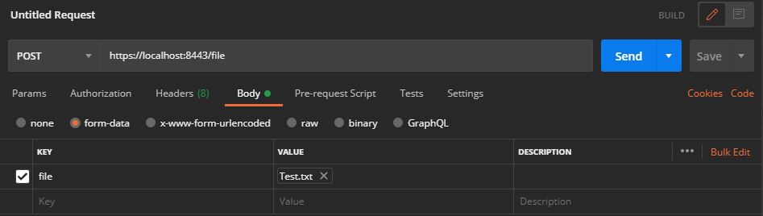

# SPRING BOOT REST API GOST2012

## Директории:

### 1. certificates

Директория, содержащая сгенерированные сертификаты для клиента и сервера.

### 2. spring-boot-rest-file-service

Директория, содержащая реализацию сервис для хэширования файлов с использованием ГОСТ 34.11-2012

## Создание сертификатов:

Все команды выполняются внутри директории certificates. Для тестирования, используем самоподписанные сертификаты.

*Везде в качестве пароля в тестовых сертификатах используем слово "secret"*

### 1. Генерация ключа и самоподписанного сертификата для сервера

```
    keytool -genkey -alias serverkey -keystore server-keystore.p12  -keyalg RSA -storetype PKCS12
```

### 2. Генерация ключа и самоподписанного сертификата для клиента

```
    keytool -genkey -alias clientkey -keystore client-keystore.p12 -keyalg RSA -storetype PKCS12
```

### 3. Экспорт сертификата сервера

```
    keytool -export -alias serverkey -file server-cert.cer -keystore server-keystore.p12
```

### 4. Экспорт сертификата клиента

```
    keytool -export -alias clientkey -file client-cert.cer -keystore client-keystore.p12
```

### 5. Импорт сертификата сервера в хранилище доверенных сертификатов клиента

```
    keytool -importcert -file server-cert.cer -keystore client-truststore.p12 -alias servercert
```

### 6. Импорт сертификата клиента в хранилище доверенных сертификатов сервера

```
    keytool -importcert -file client-cert.cer -keystore server-truststore.p12 -alias clientcert
```

## Работа с файлом (Тест работы приложения)

### 1. Добавляем в настройки Postman хранилище ключей клиента "client-keystore.pfx" и отключаем проверку SSL



### 2. Запускаем сервер и через Postman выполняем запрос с тестовым файлом.

